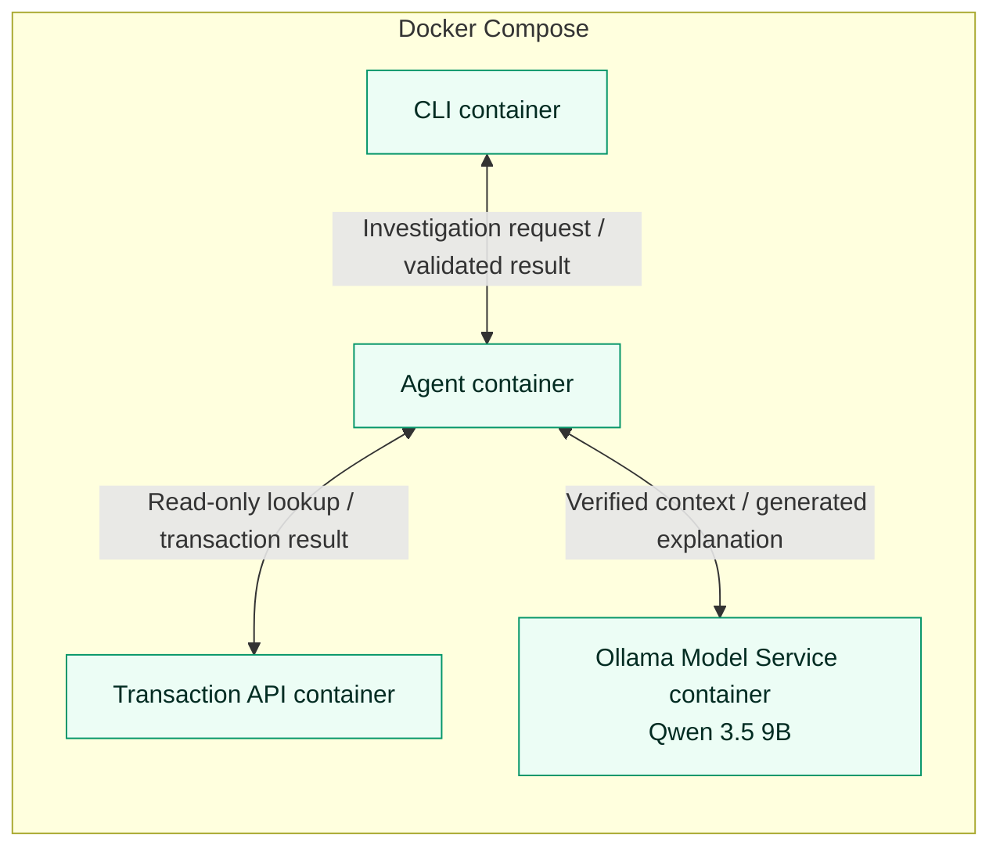

# Deployment architecture

```mermaid
flowchart LR
    subgraph compose["Docker Compose"]
        cli["CLI container"]
        agent["Agent container"]
        api["Transaction API container"]
        ollama["Ollama Model Service container<br/>Qwen 3.5 9B"]

        cli <-->|"Investigation request / validated result"| agent
        agent <-->|"Read-only lookup / transaction result"| api
        agent <-->|"Verified context / generated explanation"| ollama
    end

    classDef container fill:#ecfdf5,stroke:#059669,color:#022c22

    class cli,agent,api,ollama container
```
