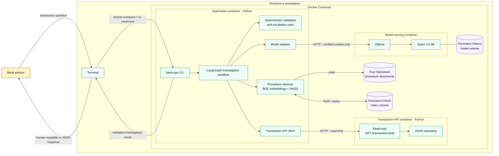

# Deployment architecture

This diagram shows the local prototype deployment defined by the accepted architecture decisions. All transaction and procedure data is fictional and remains inside the Docker Compose environment.

## Deployment notes

- The CLI, controlled workflow, deterministic business rules, and provider adapters run in one application container.
- The transaction API is a separate read-only service backed by synthetic JSON data.
- Procedure retrieval runs locally in the application container; the FAISS index is persisted in a named volume and can be rebuilt from the four Markdown source documents.
- Ollama serves `qwen3.5:9b` over the internal Compose network and keeps downloaded model data in a named volume.
- Qwen receives only verified transaction facts, retrieved procedure guidance, and the application-determined next action. It cannot call services or change a transaction.
- If Ollama is unavailable, the application returns a deterministic explanation from the verified facts and rules.
