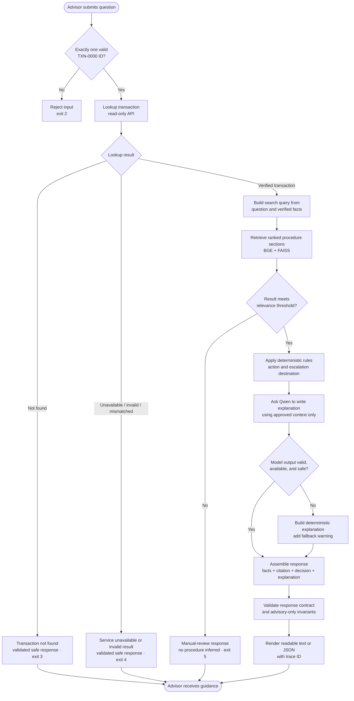

# Agent Workflow

```mermaid
flowchart TD
    start(["Advisor submits question"])
    validate{"Exactly one valid<br/>TXN-0000 ID?"}
    reject["Reject input<br/>exit 2"]
    lookup["Lookup transaction<br/>read-only API"]
    lookup_result{"Lookup result"}
    not_found["Transaction not found<br/>validated safe response · exit 3"]
    unavailable["Service unavailable or invalid result<br/>validated safe response · exit 4"]
    retrieve["Build search query from<br/>question and verified facts"]
    search["Retrieve ranked procedure sections<br/>BGE + FAISS"]
    relevant{"Result meets<br/>relevance threshold?"}
    no_procedure["Manual-review response<br/>no procedure inferred · exit 5"]
    decide["Apply deterministic rules<br/>action and escalation destination"]
    generate["Ask Qwen to write explanation<br/>using approved context only"]
    generation_result{"Model output valid,<br/>available, and safe?"}
    fallback["Build deterministic explanation<br/>add fallback warning"]
    assemble["Assemble response<br/>facts + citation + decision + explanation"]
    contract["Validate response contract<br/>and advisory-only invariants"]
    render["Render readable text or JSON<br/>with trace ID"]
    done(["Advisor receives guidance"])

    start --> validate
    validate -->|"No"| reject
    validate -->|"Yes"| lookup
    lookup --> lookup_result
    lookup_result -->|"Not found"| not_found
    lookup_result -->|"Unavailable / invalid / mismatched"| unavailable
    lookup_result -->|"Verified transaction"| retrieve
    retrieve --> search
    search --> relevant
    relevant -->|"No"| no_procedure
    relevant -->|"Yes"| decide
    decide --> generate
    generate --> generation_result
    generation_result -->|"Yes"| assemble
    generation_result -->|"No"| fallback
    fallback --> assemble
    assemble --> contract
    contract --> render
    render --> done
    not_found --> done
    unavailable --> done
    no_procedure --> done
```
