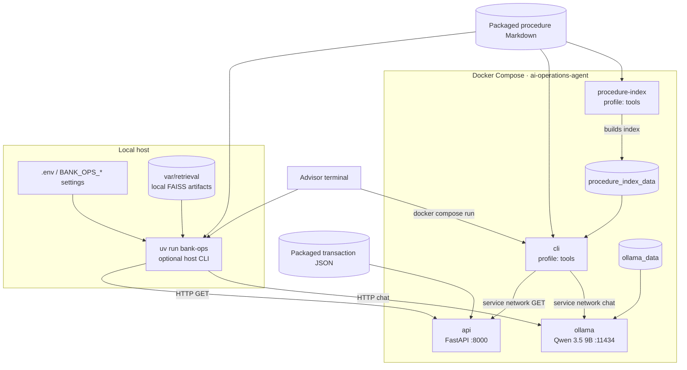

# Deployment Topology

```mermaid
flowchart TB
    advisor["Advisor terminal"]

    subgraph host["Local host"]
        host_cli["uv run bank-ops<br/>optional host CLI"]
        env[".env / BANK_OPS_* settings"]
        host_index[("var/retrieval<br/>local FAISS artifacts")]
    end

    subgraph compose["Docker Compose · ai-operations-agent"]
        cli["cli<br/>profile: tools"]
        indexer["procedure-index<br/>profile: tools"]
        api["api<br/>FastAPI :8000"]
        ollama["ollama<br/>Qwen 3.5 9B :11434"]
        index_volume[("procedure_index_data")]
        model_volume[("ollama_data")]
    end

    corpus[("Packaged procedure Markdown")]
    transactions[("Packaged transaction JSON")]

    advisor --> host_cli
    advisor -->|"docker compose run"| cli
    env --> host_cli
    host_index --> host_cli
    host_cli -->|"HTTP GET"| api
    host_cli -->|"HTTP chat"| ollama
    cli -->|"service network GET"| api
    cli -->|"service network chat"| ollama
    index_volume --> cli
    corpus --> host_cli
    corpus --> cli
    corpus --> indexer
    indexer -->|"builds index"| index_volume
    transactions --> api
    model_volume --> ollama
```
