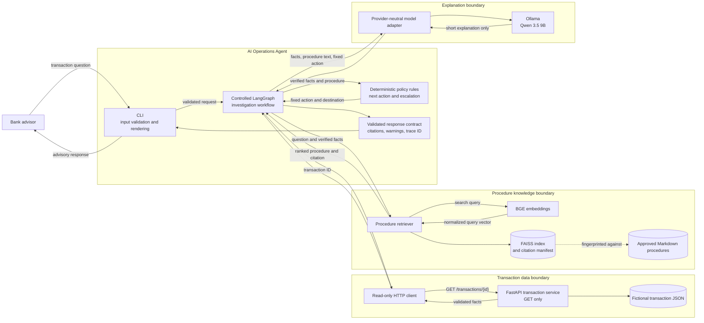

# High-Level Architecture

```mermaid
flowchart LR
    advisor["Bank advisor"]

    subgraph app["AI Operations Agent"]
        cli["CLI<br/>input validation and rendering"]
        workflow["Controlled LangGraph<br/>investigation workflow"]
        policy["Deterministic policy rules<br/>next action and escalation"]
        validator["Validated response contract<br/>citations, warnings, trace ID"]
    end

    subgraph transaction["Transaction data boundary"]
        client["Read-only HTTP client"]
        api["FastAPI transaction service<br/>GET only"]
        records[("Fictional transaction JSON")]
    end

    subgraph knowledge["Procedure knowledge boundary"]
        retriever["Procedure retriever"]
        embedder["BGE embeddings"]
        index[("FAISS index<br/>and citation manifest")]
        procedures[("Approved Markdown procedures")]
    end

    subgraph generation["Explanation boundary"]
        adapter["Provider-neutral model adapter"]
        ollama["Ollama<br/>Qwen 3.5 9B"]
    end

    advisor -->|"transaction question"| cli
    cli -->|"validated request"| workflow
    workflow -->|"transaction ID"| client
    client -->|"GET /transactions/{id}"| api
    api --> records
    api -->|"validated facts"| client
    client --> workflow
    workflow -->|"question and verified facts"| retriever
    retriever -->|"search query"| embedder
    embedder -->|"normalized query vector"| retriever
    retriever --> index
    index -. "fingerprinted against" .-> procedures
    retriever -->|"ranked procedure and citation"| workflow
    workflow -->|"verified facts and procedure"| policy
    policy -->|"fixed action and destination"| workflow
    workflow -->|"facts, procedure text, fixed action"| adapter
    adapter --> ollama
    ollama -->|"short explanation only"| adapter
    adapter --> workflow
    workflow --> validator
    validator --> cli
    cli -->|"advisory response"| advisor
```
