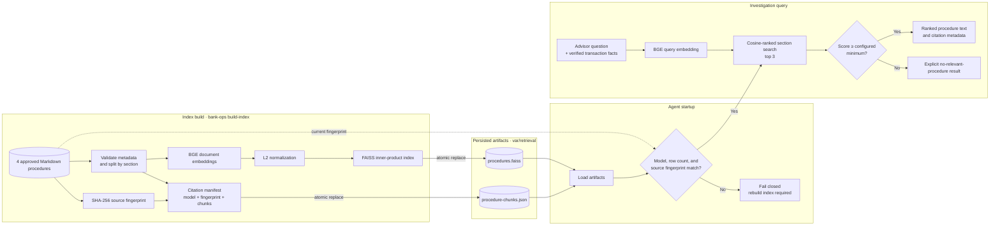

# Procedure Retrieval Lifecycle

```mermaid
flowchart LR
    subgraph build["Index build · bank-ops build-index"]
        docs[("4 approved Markdown procedures")]
        parse["Validate metadata<br/>and split by section"]
        fingerprint["SHA-256 source fingerprint"]
        doc_embed["BGE document embeddings"]
        normalize["L2 normalization"]
        faiss_build["FAISS inner-product index"]
        manifest["Citation manifest<br/>model + fingerprint + chunks"]

        docs --> parse
        docs --> fingerprint
        parse --> doc_embed --> normalize --> faiss_build
        parse --> manifest
        fingerprint --> manifest
    end

    subgraph persisted["Persisted artifacts · var/retrieval"]
        index_file[("procedures.faiss")]
        manifest_file[("procedure-chunks.json")]
    end

    faiss_build -->|"atomic replace"| index_file
    manifest -->|"atomic replace"| manifest_file

    subgraph startup["Agent startup"]
        load["Load artifacts"]
        compatibility{"Model, row count, and<br/>source fingerprint match?"}
        rebuild["Fail closed<br/>rebuild index required"]
    end

    index_file --> load
    manifest_file --> load
    docs -. "current fingerprint" .-> compatibility
    load --> compatibility
    compatibility -->|"No"| rebuild

    subgraph query["Investigation query"]
        query_text["Advisor question<br/>+ verified transaction facts"]
        query_embed["BGE query embedding"]
        rank["Cosine-ranked section search<br/>top 3"]
        threshold{"Score ≥ configured<br/>minimum?"}
        cited["Ranked procedure text<br/>and citation metadata"]
        no_match["Explicit no-relevant-procedure result"]
    end

    compatibility -->|"Yes"| rank
    query_text --> query_embed --> rank
    rank --> threshold
    threshold -->|"Yes"| cited
    threshold -->|"No"| no_match
```
