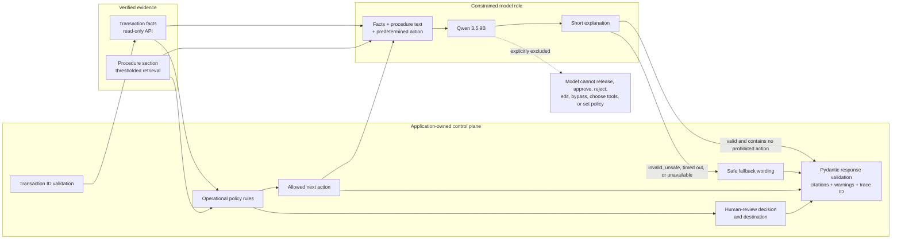

# Safety and Control Boundaries

```mermaid
flowchart LR
    subgraph evidence["Verified evidence"]
        facts["Transaction facts<br/>read-only API"]
        procedure["Procedure section<br/>thresholded retrieval"]
    end

    subgraph deterministic["Application-owned control plane"]
        input["Transaction ID validation"]
        rules["Operational policy rules"]
        action["Allowed next action"]
        escalation["Human-review decision<br/>and destination"]
        fallback["Safe fallback wording"]
        output["Pydantic response validation<br/>citations + warnings + trace ID"]
    end

    subgraph model["Constrained model role"]
        context["Facts + procedure text<br/>+ predetermined action"]
        qwen["Qwen 3.5 9B"]
        prose["Short explanation"]
    end

    input --> facts
    facts --> rules
    procedure --> rules
    rules --> action
    rules --> escalation
    facts --> context
    procedure --> context
    action --> context
    context --> qwen --> prose
    prose -->|"valid and contains no prohibited action"| output
    prose -->|"invalid, unsafe, timed out, or unavailable"| fallback
    fallback --> output
    action --> output
    escalation --> output

    prohibited["Model cannot release, approve, reject,<br/>edit, bypass, choose tools, or set policy"]
    qwen -. "explicitly excluded" .-> prohibited
```
